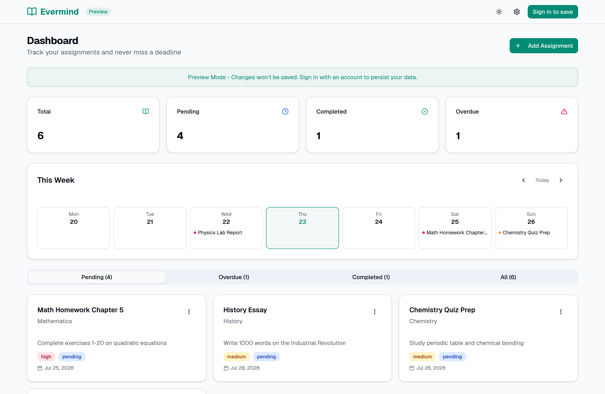

<div align="center">

# Evermind

**Never miss a deadline again.**

An assignment tracker for students — deadlines, priorities, and a weekly plan in one place.

[](https://nextjs.org/)
[](https://react.dev/)
[](https://www.typescriptlang.org/)
[](https://tailwindcss.com/)
[](https://supabase.com/)
[](LICENSE)

[**Live demo**](https://evermind.shxrk.dev) · [Try it without an account](https://evermind.shxrk.dev/preview)

</div>

---

<picture>
  <source media="(prefers-color-scheme: dark)" srcset="docs/screenshot-dark.png">
  <source media="(prefers-color-scheme: light)" srcset="docs/screenshot-light.png">
  
</picture>

---

## Features

| | |
|---|---|
| **Dashboard** | Totals for pending, completed, and overdue work at a glance. |
| **Assignments** | Create, edit, complete, and delete assignments with a subject, description, due date, and priority. |
| **Weekly planner** | See the week laid out day by day, with navigation to past and future weeks. |
| **Status tabs** | Filter between pending, overdue, completed, and all. |
| **Canvas import** | Bring in coursework from a Canvas CSV, JSON, `course-data.js`, or IMS Common Cartridge export, then pick which assignments to keep. |
| **Preview mode** | The full interface with sample data, no account required. |
| **Theming** | Light, dark, and system themes; a compact density mode; and eight built-in colour themes plus your own. |
| **Social sign-in** | Google, Discord, and GitHub via Supabase Auth. |
| **Responsive** | Built for phones through to wide desktops. |

## Tech stack

| Layer | Choice |
|---|---|
| Framework | [Next.js 16](https://nextjs.org/) (App Router, React 19, TypeScript) |
| Styling | [Tailwind CSS 4](https://tailwindcss.com/) |
| Components | [shadcn/ui](https://ui.shadcn.com/) on [Radix UI](https://www.radix-ui.com/), [Lucide](https://lucide.dev/) icons |
| Auth & database | [Supabase](https://supabase.com/) (Postgres + Row Level Security) |
| Client data | [SWR](https://swr.vercel.app/) |
| Forms & dates | [React Hook Form](https://react-hook-form.com/), [date-fns](https://date-fns.org/) |

## Getting started

### Prerequisites

- [Bun](https://bun.sh/) (this repo ships a `bun.lock`) or Node.js 20+ with npm
- A [Supabase](https://supabase.com/) project

### 1. Install

```bash
git clone https://github.com/<your-username>/evermind.git
cd evermind
bun install     # or: npm install
```

### 2. Configure the environment

Copy `.example.env` to `.env.local` and fill in your Supabase project details:

```bash
cp .example.env .env.local
```

Only two variables are needed to run the app locally:

| Variable | Where to find it |
|---|---|
| `NEXT_PUBLIC_SUPABASE_URL` | Supabase dashboard → Project Settings → API |
| `NEXT_PUBLIC_SUPABASE_ANON_KEY` | Supabase dashboard → Project Settings → API |

The remaining entries in `.example.env` are for the OAuth providers you choose to enable.

### 3. Set up the database

Run [`scripts/001_create_assignments_table.sql`](scripts/001_create_assignments_table.sql) in the Supabase SQL editor. It creates the `assignments` table, its indexes, and the Row Level Security policies that scope every row to its owner.

### 4. Configure sign-in

Enable Google, Discord, and/or GitHub under **Authentication → Providers** in Supabase, and add `http://localhost:3000/auth/callback` as a redirect URL.

### 5. Run it

```bash
bun run dev     # or: npm run dev
```

Open [http://localhost:3000](http://localhost:3000). Signed out, you land on `/preview` and can explore with sample data; signed in, you go to `/dashboard`.

## Scripts

| Command | Purpose |
|---|---|
| `bun run dev` | Start the development server |
| `bun run build` | Production build |
| `bun run start` | Serve the production build |

## Project structure

```
app/                    App Router routes
  page.tsx              "/" — fallback redirect (the proxy normally handles it)
  preview/              Signed-out demo with sample data
  dashboard/            The signed-in dashboard
  settings/             Appearance, account, and Canvas import
  auth/                 Login, OAuth callback, error states
components/             Feature components (cards, dialogs, weekly view, providers)
  ui/                   shadcn/ui primitives
hooks/                  Shared React hooks
lib/
  supabase/             Browser, server, and proxy Supabase clients
  data/                 Server-side data fetching
scripts/                SQL migrations
proxy.ts                Next.js proxy (middleware) — session refresh and routing
```

## Architecture notes

**Auth runs in the proxy.** `proxy.ts` refreshes the Supabase session on every request, so it already knows who you are. Routing decisions live there rather than in page components: `/` redirects to `/dashboard` or `/preview` with a real `307`, and `/dashboard` bounces signed-out visitors to the login page. Deciding in a page component instead would flush the streaming shell first, turning the redirect into a full page load plus a client-side navigation.

**Time and timezone rendering is deferred to the client.** The server renders in UTC, so anything derived from the visitor's clock — "Due today", which days make up this week — would mismatch during hydration. Those values render a timezone-pinned placeholder until `useMounted()` flips, then resolve locally. Absolute timestamps come from the server so both sides agree.

**Every row is scoped by the database.** Row Level Security policies in the schema restrict `select`, `insert`, `update`, and `delete` to `auth.uid() = user_id`, so authorisation does not depend on the client asking nicely.

## Deployment

The app deploys to [Vercel](https://vercel.com/) as-is. Set `NEXT_PUBLIC_SUPABASE_URL` and `NEXT_PUBLIC_SUPABASE_ANON_KEY` in the project's environment variables, and add `https://<your-domain>/auth/callback` to the redirect URLs in Supabase.

## License

[GNU General Public License v3.0](LICENSE)
